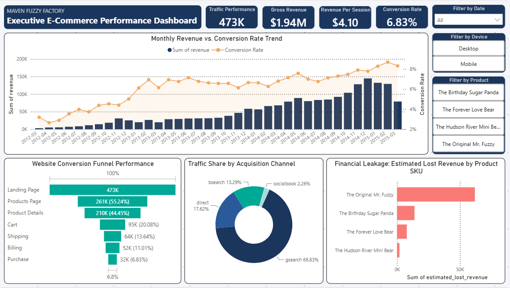

# Maven Fuzzy Factory – E-Commerce Analytics Project

## Overview

This project demonstrates an end-to-end analytics workflow using MySQL and Power BI to analyse e-commerce performance.

The solution transforms raw transactional and web activity data into business-ready insights covering marketing performance, customer conversion behaviour, and product revenue analysis.

Dataset provided by Maven Analytics.

---

## Business Questions Addressed

- Which marketing channels generate the most traffic and revenue?
- How effectively does the website convert visitors into customers?
- Where are the biggest drop-off points in the conversion funnel?
- Which products contribute the most revenue?
- How much revenue is potentially lost through refunds?

---

## Tools & Technologies

- MySQL
- SQL
- Power BI
- Excel

---

## Data Preparation

The project includes:

- Data ingestion from multiple CSV files
- Timestamp standardisation and datatype conversion
- Data quality validation and duplicate checks
- Schema optimisation using indexing
- Creation of reusable analytical views

### Source Tables

- website_sessions
- website_pageviews
- orders
- order_items
- products
- order_item_refunds

---

## SQL Analytics Layer

Three analytical views were created to support dashboard reporting:

### vw_marketing_performance

Provides marketing and acquisition metrics including:

- Sessions
- Orders
- Revenue
- Conversion Rate
- Revenue per Session
- Device Performance

### vw_funnel_analysis

Tracks user progression through the website funnel:

- Landing Page
- Products Page
- Product Details
- Cart
- Shipping
- Billing
- Purchase

### vw_product_revenue_loss

Measures product performance through:

- Gross Revenue
- Net Profit
- Refund Volume
- Estimated Lost Revenue

---

## Dashboard Highlights

| KPI | Value |
|------|------|
| Total Sessions | 473K |
| Total Revenue | $1.94M |
| Revenue per Session | $4.10 |
| Conversion Rate | 6.83% |

---

## Key Insights

- Search traffic generated the majority of website sessions.
- The largest customer drop-off occurred between the Product Details and Cart stages.
- Conversion rates improved steadily throughout the reporting period.
- Revenue growth closely followed increases in website traffic.
- The Original Mr. Fuzzy recorded the highest estimated revenue loss from refunds.

---

## Repository Contents

- `maven_fuzzy_factory.sql` – Database setup, transformation, and analytical views
- `dashboard.pbix` – Power BI dashboard
- `dashboard.png` – Dashboard preview

---

## Skills Demonstrated

- SQL Data Cleaning
- Data Modelling
- Data Transformation
- Exploratory Data Analysis (EDA)
- Funnel Analysis
- Marketing Analytics
- KPI Development
- Business Intelligence Reporting
- Power BI Dashboard Design

---

## Author

Siti Madihah
